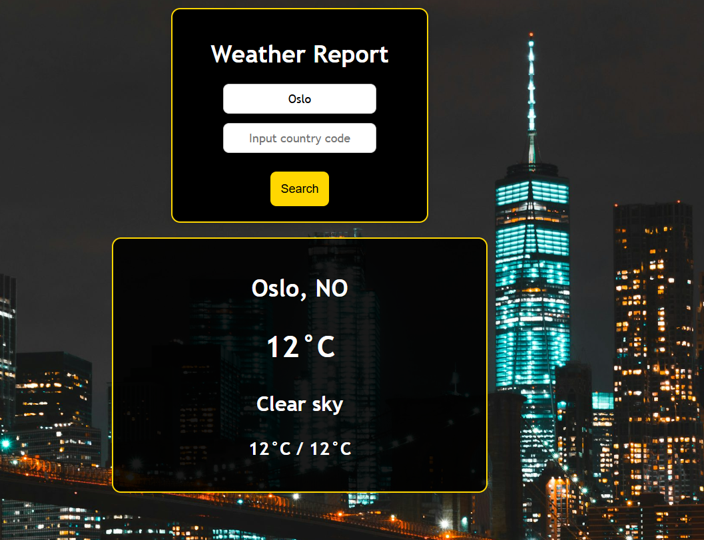

<h1 align="center">Weather API</h1>

  <h3>
    <a href="https://ande-glitch.github.io/WeatherAPI/index.html">
      Link to project
    </a>
  </h3>

<!-- TABLE OF CONTENTS -->

## Table of Contents

- [Overview](#overview)
- [Built With](#built-with)
- [Features](#features)
- [How to use](#how-to-use)
- [Contact](#contact)

<!-- OVERVIEW -->
## Overview
- En nettside som tar seg bruk av API ved å hente data og vise det på skjermen. Dette API'en er basert på vær.

## Hvordan Brukes?
- På feltene "Input name of place" og "Input country code" kan man velge å taste inn byen med eller uten country code. Med country code vil det være mer presist. Etter av å ha valgt for seg by og country code kan man få resultat av været og temperaturen ved stedet ved å trykke på "Search" knappen.

Infoen vil gjerne stå som:
Navn av byen
Temperatur i celcius
Vær beskrivelsen
Min og maks temperatur.

## Features
- API call
- Redudans sjekk
- DOM manipulasjon
- Dynamisk

## Utfordringer
- Design (ChatGPT)

## Løsning
- Samarbeid
- Hjelp av klassekamerater
- KI / AI

## Contact
- GitHub [Ande-Glitch](https://github.com/Ande-glitch)
- Epost [And Nguyen](mailto:andynuwen@gmail.com)

## Result

